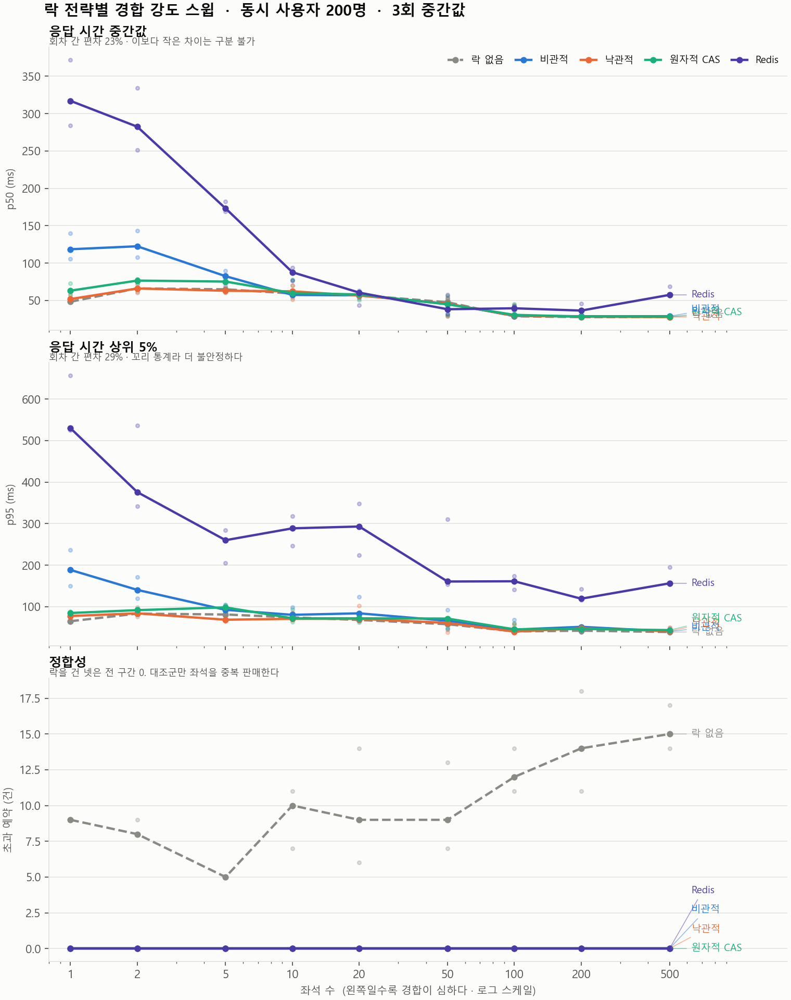
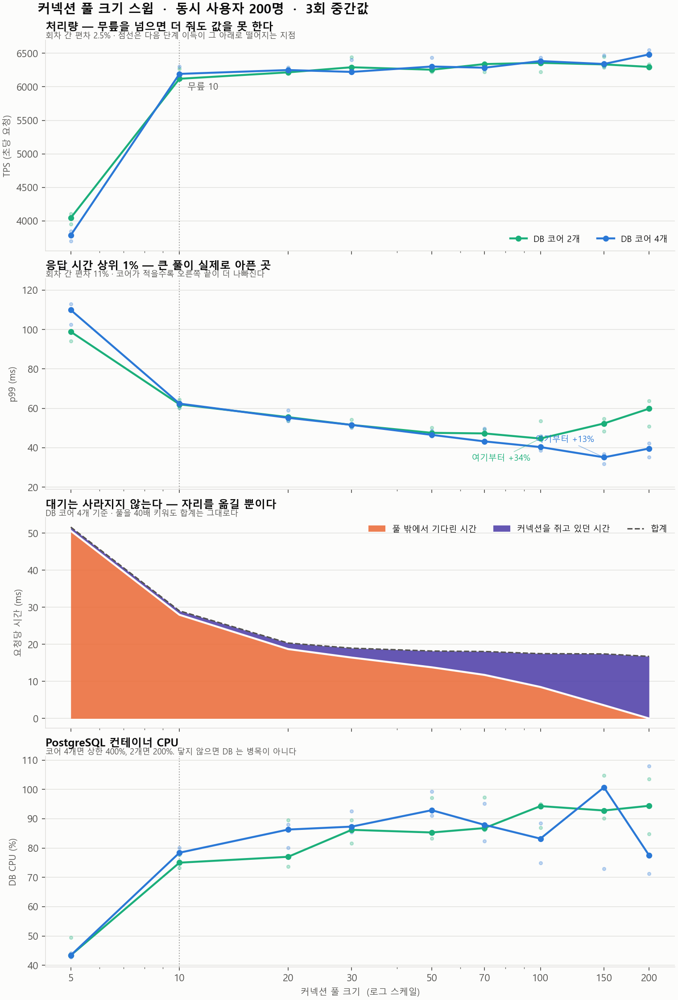

# ticket-lab

공연 좌석 예매 API입니다.
티켓 오픈 때처럼 한 좌석에 요청이 몰릴 때 어떻게 처리할지, 부하 테스트로 직접 재보고 결정했습니다.

**Stack** Spring Boot 4.1.1 · Java 21 · PostgreSQL 18.6 · Redis 8.8 (Redisson) · Flyway · k6 · Prometheus · Grafana · Testcontainers

---

## 1. 좌석 중복 예약

- 좌석 선점이 `조회 → 상태 확인 → 저장` 순서라서, 동시에 들어온 요청이 모두 빈 좌석으로 보고 저장함
- 락 없이 동시 사용자 200명으로 테스트하면 매 실행 5~18건 중복, 좌석 1개에 예약이 10건까지 생김
- 상태 확인을 UPDATE 문의 WHERE 절로 옮겨서 해결 → 중복 0건

```sql
UPDATE seat SET status = 'HELD'
WHERE id = :id AND status = 'AVAILABLE'   -- 0행이면 이미 팔린 좌석
```

## 2. 락 전략 비교

좌석 수를 1~500으로 바꿔가며 전략 5개를 비교했습니다. 좌석이 적을수록 같은 자리를 노리는 요청이 많습니다.

| 좌석 수 | 락 없음 | 비관적 락 | 낙관적 락 | 조건부 UPDATE | Redis 락 |
|---:|---:|---:|---:|---:|---:|
| 1 | 48 ms | 118 ms | 52 ms | 63 ms | 317 ms |
| 5 | 65 | 82 | 63 | 75 | 173 |
| 10 | 59 | 57 | 62 | 60 | 88 |
| 500 | 28 | 29 | 28 | 28 | 57 |

*p50 응답 시간, 조건별 3회 중간값*

- 좌석 5개 이하에서 비관적 락이 낙관적 락보다 최대 2.3배 느림. 예매는 진 요청이 재시도 없이 끝나는데, 비관적 락은 그 요청들도 줄 서서 기다림
- 좌석 10개부터는 락 없음 / 비관적 / 낙관적 / 조건부 UPDATE 간 차이가 없음
- Redis 락은 좌석 1~10에서 가장 빠른 방식보다 1.5~6.6배 느림
- 버전 컬럼과 재시도 로직 없이 같은 결과가 나오는 조건부 UPDATE를 선택



## 3. 커넥션 풀 크기

풀 크기를 5~200으로 바꿔가며 측정했습니다.

- 풀 5→10에서 처리량 64% 증가, 이후 200까지는 4.7%
- 풀을 키우면 커넥션을 기다리는 시간은 0에 가까워지지만, 커넥션을 쥐고 있는 시간이 그만큼 늘어남. 대기가 DB 안으로 옮겨간 것
- `(코어 × 2) + 1` 공식은 4코어에서는 맞았지만 코어를 2개로 줄여도 결과가 같았음. DB가 CPU 병목이 아니었음
- 기본값 10으로 충분



---

## 측정 방식

- 조건마다 DB를 초기화하고 앱을 새로 띄운 뒤, 워밍업을 버리고 3회 측정해서 중간값을 사용
- 최종 결과는 모든 회차 오류율 0. 오류율이 높았던 측정은 버리고 다시 쟀고, 버린 데이터도 `loadtest/results/`에 남겨둠
- k6와 서버가 같은 컴퓨터에서 돌기 때문에 절대 수치가 아니라 조건끼리의 비교만 결론으로 씀

## 실행

```bash
docker compose up -d --wait     # PostgreSQL, Redis, Prometheus, Grafana
./gradlew bootRun               # http://localhost:8080/actuator/health
```

실험 (Windows PowerShell):

```powershell
.\gradlew.bat bootJar
.\loadtest\run-experiment.ps1 -Sweep SEAT_COUNT -Values 1,2,5,10,20,50,100,200,500 `
  -Strategies none,pessimistic,optimistic,atomic,redis -Vus 200 `
  -Out "loadtest/results/contention.csv"
python loadtest/plot_strategies.py --max-seats 500
```

락 전략은 `LOCK_STRATEGY`, 풀 크기는 `DB_POOL_SIZE` 환경변수로 바꿉니다. 나머지 설정은 `application.yml`에 있습니다.

## 구조

```
src/main/java/com/ticketlab/
├── auth/             JWT 인증
├── event/            공연, 좌석
├── reservation/      좌석 선점
│   └── lock/         락 전략 5개
├── queue/            대기열 (미완성)
└── common/           보안, 에러 처리, 로깅

loadtest/
├── reserve.js              k6 시나리오
├── run-experiment.ps1      조건을 바꿔가며 반복 측정
├── plot_*.py               그래프
└── results/                측정 결과 CSV, 그래프
```

## 설계하면서 고민한 것

- **낙관적 락에 JPA `@Version`을 쓰지 않음** — `@Version`은 좌석의 모든 쓰기에 적용돼서, 비교용으로 일부러 안 막아둔 "락 없음" 버전까지 막아버림
- **`open-in-view: false`** — 켜두면 응답이 끝날 때까지 커넥션을 잡고 있어서 커넥션 풀 측정이 의미 없어짐
